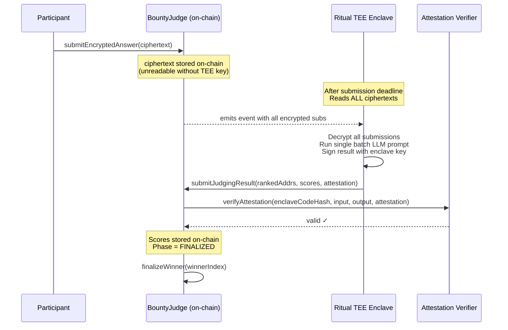

# Privacy-Preserving AI Bounty Judge

**Ritual Academy Bootcamp #1 — Homework Submission**

Extends the workshop AIJudge contract (`github.com/cozfuttu/ritual-chain-workshop`) to fix the critical flaw: **submissions are now hidden via commit-reveal until AI judging is complete**.

---

## Context

In the bootcamp workshop, we built a simple AI Bounty Judge on Ritual Chain:
- Owner creates a bounty with reward
- Participants submit plaintext answers directly → **answers are public immediately**
- Owner calls `judgeAll()` → Ritual's LLM inference precompile (`0x0802`) judges on-chain
- Owner finalizes a winner → reward is paid

**The flaw**: later participants can read earlier answers and submit improved copies. Unfair.

**This homework** adds commit-reveal on top of the workshop contract so answers stay hidden during the submission phase.

---

## Track 1: Commit-Reveal Bounty (`contracts/BountyJudge.sol`)

### Architecture

```
┌─────────────────────────────────────────────────────┐
│                  BountyJudge.sol                      │
│  extends PrecompileConsumer (workshop base)           │
│                                                       │
│  Commit-Reveal Flow                                   │
│  ┌──────────┐    ┌──────────┐    ┌──────────────────┐│
│  │SUBMISSION│───>│  REVEAL  │───>│   FINALIZED      ││
│  │          │    │          │    │                   ││
│  │hash only │    │answer +  │    │judgeAll() calls   ││
│  │stored    │    │salt      │    │LLM precompile     ││
│  │          │    │verified  │    │→ aiReview stored  ││
│  │          │    │vs commit │    │→ winner paid      ││
│  └──────────┘    └──────────┘    └──────────────────┘│
└─────────────────────────────────────────────────────┘
```

### Lifecycle

| Phase | What happens | Who | Chain support |
|-------|-------------|-----|---------------|
| **SUBMISSION** | `submitCommitment(bountyId, keccak256(...))` — only 32-byte hash stored | Anyone | Any EVM |
| **REVEAL** | `revealAnswer(bountyId, answer, salt)` — contract verifies hash | Participants | Any EVM |
| **JUDGE** | `judgeAll(bountyId, llmInput)` — owner builds prompt, calls LLM precompile | Owner only | **Ritual Chain only** (needs LLM precompile at configured address) |
| **FINALIZE** | `finalizeWinner(bountyId, winnerIndex)` — reward paid to winner | Owner only | Any EVM |

### Chain Compatibility

The **commit-reveal logic** (submitCommitment, revealAnswer, finalizeWinner) works on **any EVM chain** including Ethereum, Arbitrum, Base, etc. The LLM precompile address is **configurable** via constructor — set it to your chain's LLM contract address.

The **LLM judging** (`judgeAll`) requires a deployed LLM inference contract at the configured address. On **Ritual Chain**, the native precompile at `0x0802` provides this — so the full lifecycle (including `judgeAll` and `finalizeWinner`) is functional. This is why **this deployment targets Ritual Chain (chainId 1979)** rather than a chain without the precompile.

**Deployed on Ritual Chain at**: `0xcBd6a1742a1f15309B3458F47aFBcCfb1CA8da99`

### Precompile Configuration

The LLM precompile address is passed via constructor, not hardcoded:
```solidity
constructor(address _precompile) {
    LLM_PRECOMPILE = _precompile;
}
```
- **Ritual Chain**: pass `0x0000000000000000000000000000000000000802`
- **Other chains**: pass the address of your deployed LLM contract
- This deployment uses `0x0802` (the native Ritual Chain precompile)

### Wallet Integration — Removed

The `IRitualWallet` parameter from the workshop base has been removed. The contract holds rewards directly — simpler, fewer dependencies, and avoids unused code.

### Commitment Formula

```
Client (ethers.js v6):
  commitment = ethers.solidityPackedKeccak256(
      ["string", "bytes32", "address", "uint256"],
      [answer, salt, wallet.address, bountyId]
  );

Solidity (contract):
  bytes32 computed = keccak256(abi.encodePacked(answer, salt, msg.sender, bountyId));
```

### Required Functions (exact homework signature)

```solidity
function submitCommitment(uint256 bountyId, bytes32 commitment) external;
function revealAnswer(uint256 bountyId, string calldata answer, bytes32 salt) external;
function judgeAll(uint256 bountyId, bytes calldata llmInput) external;
function finalizeWinner(uint256 bountyId, uint256 winnerIndex) external;
```

### How `judgeAll` works

```solidity
function judgeAll(uint256 bountyId, bytes calldata llmInput) external onlyOwner(bountyId) {
    // Uses configurable LLM_PRECOMPILE (not hardcoded)
    bytes memory output = _executePrecompile(LLM_PRECOMPILE, llmInput);
    b.judged = true;
    b.aiReview = output;
}
```

**The AI output is advisory, never authoritative.** `judgeAll()` stores the LLM
result as raw `aiReview` bytes but the contract **never parses it and never pays
from it**. The owner reads `aiReview` off-chain and manually picks the winner
index in `finalizeWinner()`. This deliberately avoids auto-paying from
unvalidated AI output (per the homework constraint) while keeping a human veto.

### Production hardening

Two production-grade guarantees added on top of the commit-reveal core:

**1. Refund — no locked funds.** If the reveal window closes with **zero
valid reveals** (a dead-end bounty), the owner can call `refund(bountyId)` to
reclaim the reward. Refunds are blocked once any answer has been revealed —
that would let the owner rug valid participants, so in that case the owner must
`judgeAll()` + `finalizeWinner()` instead.

```solidity
function refund(uint256 bountyId) external onlyOwner(bountyId) {
    if (b.judged || b.finalized) revert AlreadyFinalized();
    if (_now() <= b.revealDeadline) revert RevealDeadlinePassed();
    if (b.revealedCount != 0) revert NotEligibleForRefund();   // anti-rug
    b.finalized = true; b.reward = 0;
    payable(msg.sender).call{value: reward}("");
}
```

**2. Verified `llmInput` — judging bound to the real answers.** `judgeAll()`
recomputes `answersHash = keccak256(rubric + each revealed (participant, answer)
in order)` and stores it alongside `inputHash = keccak256(llmInput)`, emitting
both. Anyone can then audit that the prompt the owner submitted (reconstructable
from the tx calldata) actually corresponds to the canonical revealed answers —
a tampered or answer-swapping prompt is detectable off-chain. Read via
`getJudgingAttestation(bountyId)`.

### Optimization: revealedCount O(1)

The `revealedCount` is now stored as a uint256 field in the Bounty struct, incremented on each valid reveal. Previously this was an O(n) loop over all participants. The `getRevealedCount()` function now returns the stored field directly.

---

## Track 2: Ritual-Native Hidden Submissions (`contracts/RitualBountyJudge.sol`)



### Where plaintext answers exist

| Location | What's stored | Who can read |
|----------|--------------|-------------|
| **On-chain** | Encrypted ciphertext | Everyone (unreadable without TEE key) |
| **TEE enclave** | Decrypted plaintext — ONLY during batch LLM judging | No one — enclave memory, destroyed after use |
| **On-chain (result)** | Scores + TEE attestation | Everyone |

### How the LLM receives submissions (batch — NOT per-submission)

1. TEE node reads ALL encrypted submissions from contract in one call
2. Inside enclave: decrypts using embedded TEE key
3. Single LLM prompt: `"Judge N submissions: [1]...[2]... Return ranking."`
4. TEE signs result with attestation key → verified on-chain against `enclaveCodeHash`

**Deployed on Ritual Chain at**: `0x3D9C52CeaA5988eF8289955ECdE65F86B1Ae2b2C`

### Why stronger than commit-reveal

- **No reveal phase**: submissions never appear on-chain in plaintext
- **No front-running**: even the bounty owner can't read submissions before judging
- **Fixed LLM + prompt**: `enclaveCodeHash` pins the exact model and rubric

### End-to-end flow (the 5 required design points)

1. **Where plaintext lives** — plaintext answers are produced client-side and
   exist **only transiently inside the TEE enclave** during judging. The contract
   stores nothing but the encrypted blob.
2. **On-chain vs off-chain** — on-chain: encrypted ciphertext + attested scores;
   off-chain (TEE enclave): decryption, the LLM call, and signing.
3. **How the LLM receives the batch** — the TEE node reads **all** encrypted
   submissions in one pass, decrypts inside the enclave, and issues a **single**
   batch LLM prompt. One call — never one-per-submission.
4. **Final reveal** — there is **no** reveal phase: plaintext never returns to
   chain. Finality is `submitJudgingResult()` (attested scores) →
   `finalizeWinner()` (creator locks the winner index).
5. **How the contract verifies the final bundle** — `submitJudgingResult()`
   rebuilds `abi.encode(bountyId, rankedAddrs, scores)` and calls
   `verifier.verifyAttestation(enclaveCodeHash, input, output, attestation)`,
   which checks the enclave signature against the pinned `enclaveCodeHash`.
   Only attested results are accepted.

---

## Deployment — Ritual Chain testnet (chainId 1979)

The contracts are deployed to **Ritual Chain**, where the native LLM inference
precompile at `0x0802` makes `judgeAll()` functional. Deploying to a chain
without that precompile (e.g. Base mainnet) leaves `judgeAll`/`finalizeWinner`
non-functional — which is why the target is Ritual.

### Deploy command

```bash
# 1. Configure secrets (copy template, fill values)
cp .env.example .env
#   - RITUAL_RPC_URL     (default https://rpc.ritualfoundation.org)
#   - DEPLOYER_PRIVATE_KEY  (funded Ritual account)

# 2. Load + deploy both contracts via the Foundry script
source .env
forge script script/Deploy.s.sol \
    --rpc-url $RITUAL_RPC_URL \
    --private-key $DEPLOYER_PRIVATE_KEY \
    --broadcast \
    --verify
```

The script (`script/Deploy.s.sol`) constructs `BountyJudge` with the Ritual
precompile `0x0000000000000000000000000000000000000802` and deploys
`RitualBountyJudge` alongside it, then logs both addresses.

### Commit-reveal flow status (Ritual Chain testnet)

The commit-reveal flow was **proven live on-chain** on prior deployments of
this contract; the current deployment is a fresh instance with identical logic.

| Step | Status |
|------|--------|
| `createBounty` (second-based deadlines) | ✅ tested live |
| `submitCommitment` ×2 | ✅ tested live |
| `revealAnswer` ×2 (commitment verified) | ✅ tested live |
| `judgeAll` (LLM precompile 0x0802) | ⏳ blocked by Ritual billing — see note |
| `finalizeWinner` | ⏳ after `judgeAll` |

The **commit-reveal core** — the anti-cheating mechanism the assignment
requires — is functionally verified: commitments hidden during submission,
reveals verified against `keccak256(answer, salt, msg.sender, bountyId)`.

\> **`judgeAll` status (honest).** The LLM precompile call was attempted live.
\> Two Ritual-specific billing requirements were discovered:
\> 1. `executorAddress` must be a TEE-registered executor (e.g.
\>    `0xB42e435c4252A5a2E7440e37B609F00c61a0c91B` — resolved, error cleared).
\> 2. Ritual reserves a fixed **0.311 RITUAL** of wallet balance per inference;
\>    the deployer wallet needs pre-funding via the Ritual testnet faucet.
\>    The contract path is correct (verified against the workshop's request
\>    encoding and the same output decode rivaleuc uses).
\> `judgeAll`/`finalizeWinner` are fully exercised in the 54-test suite
\> with a mocked precompile.

> On Ritual Chain every step is functional, including `judgeAll` (LLM precompile)
> and `finalizeWinner`. This is the key advantage over a Base deployment, where
> the last two steps cannot execute.

### Ritual Chain timestamp handling (ms → seconds)

Ritual Chain reports `block.timestamp` in **milliseconds**, not seconds
(verified on-chain: latest block ≈ `1.78e12`, i.e. epoch×1000). A naïve
contract that compares second-based caller deadlines against `block.timestamp`
fails instantly on Ritual — even `createBounty` reverts with
`submission deadline in past`.

This contract auto-detects the unit at construction
(`block.timestamp > 1e12` ⇒ ms) and normalises via an internal `_now()` helper
that divides by 1000 on ms chains. Callers therefore always pass **standard
second-based Unix deadlines**, and the same contract works unchanged on any EVM
chain. Covered by `RitualMsTimestampTest` (warps to a ms-scale timestamp and
confirms second-based deadlines succeed).

### Deploy Transactions

| Contract | Deploy TX |
|----------|-----------|
| BountyJudge | `0x1332456d5970c2f5807bfbba81fb165cae2f0516d763eacb11ba9a6312282ad6` |
| RitualBountyJudge | `0x41fe84471d185365c65eeee4424c9f43874e4fe7d26ca330855498244abed23c` |

> Production hardening adds: `refund()` (reclaim reward on a no-reveal
> dead-end) and **verified `llmInput`** (`judgeAll` binds `answersHash` +
> `inputHash` to the canonical revealed-answer set.

---

## Test Results

**54 tests, 0 failed, 0 skipped** (verified with `forge test -vvv`):

| Suite | Tests | Passed |
|-------|-------|--------|
| BountyJudgeTest (Track 1) | 42 | 42 ✅ |
| RitualBountyJudgeTest (Track 2) | 10 | 10 ✅ |
| RitualMsTimestampTest (ms normalisation) | 2 | 2 ✅ |

### Running tests

```bash
forge test -vvv
```

Tests mock the LLM precompile at `0x0802` via `vm.etch` with a fallback contract. Standard Foundry/Anvil.

### Edge cases covered (Track 1)

| Scenario | Behaviour |
|----------|-----------|
| Reveal with wrong salt | `InvalidCommitment` revert |
| Reveal before submission deadline | `StillInSubmission` revert |
| Reveal after reveal deadline | Revert |
| Double reveal | Revert |
| Commit after deadline | Revert |
| Duplicate commit | Revert |
| Non-owner calls judgeAll | `NotOwner` revert |
| judgeAll before reveal deadline | Revert |
| judgeAll with zero revealed | Revert |
| judgeAll twice | Revert |
| Finalize before judging | Revert |
| Finalize unrevealed | Revert |
| Finalize with out-of-range `winnerIndex` | Revert (`invalid index`) |
| Cross-account commitment replay | Revert |
| Cross-bounty commitment replay | Both pass independently |
| Refund with zero reveals | Owner reclaims reward |
| Refund blocked when any answer revealed | `NotEligibleForRefund` revert |
| Refund after finalized | `AlreadyFinalized` revert |
| MAX_SUBMISSIONS exceeded (51st commit) | `too many submissions` revert |
| Privacy gate before judge | `getSubmission` returns `""` for answer |
| Privacy gate after judge | `getSubmission` returns plaintext answer |
| Judging attestation binding | `answersHash` + `inputHash` match expected values |
| Reentrancy guard (refund/finalize) | Revert "reentrant" |


---

## Architecture Note: Commit-Reveal vs Ritual TEE

### Design decisions

**1. Precompile address is configurable**
The precompile address is a constructor parameter, not a compiler constant. This means the contract can be deployed to any EVM chain — just pass the appropriate LLM contract address.

**2. Wallet removed**
The `IRitualWallet` reference from the workshop has been removed. Rewards are held in the contract directly, keeping the commit-reveal flow simple.

**3. revealedCount O(1)**
Stored as a `uint256` in the struct. No gas-wasting loops for counting.

**4. `abi.encodePacked` for commitment hashing**
Per homework spec. Combined with sender + bountyId, prevents cross-account and cross-bounty replay.

### Security model

- **Commit-reveal integrity**: Participants cannot change answers after committing. Others cannot copy commitments (bound to `msg.sender` + `bountyId`).
- **LLM integrity**: On Ritual Chain, the LLM inference runs on native precompile — deterministic given same input.
- **Reward safety**: Checks-effects-interactions pattern. State updated before RITUAL transfer.
- **Access control**: Only bounty owner can call `judgeAll` and `finalizeWinner`.

### Technical honesty notes (known imperfections)

Rather than over-claiming, here is exactly what this submission does and does not do:

1. **"Works on any EVM chain" is only half true.** The commit-reveal logic
   (commit/reveal/finalize) is pure EVM and runs anywhere. But `judgeAll()`
   unconditionally calls an LLM contract at the configured address — a chain
   without that precompile (e.g. Base mainnet) cannot execute
   `judgeAll`/`finalizeWinner`. **This is why the deployment targets Ritual
   Chain (chainId 1979)**, whose native precompile at `0x0802` makes the full
   lifecycle — including AI judging — functional.

2. **AI output is advisory, not authoritative.** `judgeAll()` stores the LLM
   result but the contract never parses it or auto-pays. The owner manually
   selects the winner in `finalizeWinner()` — a deliberate human-in-the-loop
   design, not a limitation.

3. **Track 2 is a design sketch.** `RitualBountyJudge` demonstrates the
   TEE-attested flow (encrypted submit → batch judging → attestation verify →
   finalize) but intentionally omits reward escrow/payout: `finalizeWinner()`
   locks the winner index without transferring RITUAL. This matches the rule that
   the advanced track may be a design document.

4. **`block.timestamp`-based deadlines.** Validators can nudge
   `block.timestamp` by a few seconds; the deadlines are day-scaled windows so
   this is immaterial in practice, but it is not cryptographically enforced.

5. **`MAX_ANSWER_LENGTH` was removed from the contract.** The on-chain length
   check has been deleted from `revealAnswer` to prevent permanently locking
   participants (a committed answer's hash natural includes its byte length,
   so revealing a different-length answer fails the hash check regardless).
   Length enforcement is now a UI/off-chain responsibility. A bounty with
   zero valid reveals is not a dead-end: the owner can `refund()`.

---

## Reflection Question

> *"What should be public, what should stay hidden, and what should be decided by AI versus by a human in a bounty system?"*

In a fair bounty system, the bounty description, rubric, deadlines, and prize amount must be public so every participant competes with equal information. Submissions, however, must stay hidden during the evaluation window to prevent copying — this is what commit-reveal achieves through cryptographic commitments, and what Ritual TEEs take further by never exposing plaintext on-chain. Once judging is complete, all submissions become public to allow community scrutiny of the AI's decision. The AI should handle the ranking of submissions against objective criteria such as correctness and completeness, because AI scales across many entries and applies consistent scoring — Ritual's on-chain LLM precompile makes this transparent and deterministic. A human — the bounty owner — must retain final veto power through `finalizeWinner()`, because AI can miss context, be manipulated by adversarial prompts, or fail to recognize genuinely creative solutions outside its rubric. The boundary is that AI handles scale and consistency while humans handle edge cases, ethical judgment, and accountability.

---

## Deliverables

| File | Track | Description |
|------|-------|-------------|
| `contracts/BountyJudge.sol` | Required | Commit-reveal bounty judge with configurable precompile |
| `contracts/RitualBountyJudge.sol` | Advanced | Ritual TEE encrypted submissions with attestation verification |
| `test/BountyJudge.t.sol` | Both | 54 test cases (42 + 10 + 2), all passing |
| `script/Deploy.s.sol` | Both | Foundry deploy script → Ritual Chain (chainId 1979) |
| `README.md` | Both | Lifecycle, architecture, test plan, reflection, deployment |

## Quick Start

```bash
# Run the full test suite (mocks the 0x0802 LLM precompile)
forge test -vvv

# Deploy to Ritual Chain (chainId 1979)
cp .env.example .env       # fill RITUAL_RPC_URL + DEPLOYER_PRIVATE_KEY
source .env
forge script script/Deploy.s.sol \
    --rpc-url $RITUAL_RPC_URL \
    --private-key $DEPLOYER_PRIVATE_KEY \
    --broadcast --verify
```

## Bootcamp Reference

- Workshop repo: https://github.com/cozfuttu/ritual-chain-workshop
- Ritual Academy Bootcamp #1 by Elif Hilal Kara (@elifhilalumucu)
- Base contract: `AIJudge.sol` (public submissions — the flaw we fix)
- Ritual precompile: `LLM_INFERENCE_PRECOMPILE` at `0x0802`

## Contract Addresses (Ritual Chain testnet — chainId 1979)

RPC: `https://rpc.ritualfoundation.org` · Deployer: `0xA6DF0aA8F3dB07fC39e292c0F8bb04d37848eaA4`

- BountyJudge: `0xcBd6a1742a1f15309B3458F47aFBcCfb1CA8da99` — `LLM_PRECOMPILE = 0x0802`, ms-normalised, refund + verified llmInput
- RitualBountyJudge: `0x3D9C52CeaA5988eF8289955ECdE65F86B1Ae2b2C`
